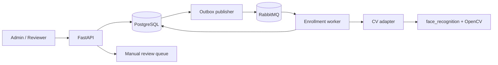

# VisionPass

Платформа регистрации участников и контроля доступа с асинхронным созданием
биометрических шаблонов, ручной проверкой сомнительных результатов и полным
аудитом действий.

> Проект **не разрабатывает собственную ML-модель**. Production-адаптер
> интегрирует готовые `face_recognition` и OpenCV. Детерминированный `stub`
> используется только для воспроизводимых локальных тестов бизнес-процесса.

## Возможности

- JWT-аутентификация и роли `admin` / `reviewer`;
- события и участники с защитой от дублей;
- обязательная фиксация согласия перед enrollment;
- временное хранение исходного фото только до обработки worker-ом;
- RabbitMQ + transactional outbox для фонового создания шаблона;
- хранение embedding без исходного изображения;
- решения `granted`, `denied` и `review` по двум порогам;
- единственное ручное решение reviewer-а для сомнительной попытки;
- аудит без фотографий и embedding-векторов;
- удаление шаблона и полная анонимизация демонстрационного участника;
- PostgreSQL, Alembic, OpenAPI, healthcheck и интеграционные тесты.

## Поток данных



Enrollment worker превращает фото в embedding и немедленно очищает исходные
байты как при успехе, так и при отклонении. Фото с проходной точки используется
в памяти запроса и в базу не записывается.

## Быстрый запуск

Локальный воспроизводимый режим бизнес-логики:

```bash
docker compose up --build --detach
```

- Swagger UI: <http://localhost:8050/docs>
- healthcheck: <http://localhost:8050/health>
- RabbitMQ Management: <http://localhost:15685>

Учётные записи:

```text
admin@example.com / ChangeMe123!
reviewer@example.com / ChangeMe123!
```

`/health` явно показывает `matcher_backend=stub`, поэтому демо нельзя ошибочно
выдать за реальное распознавание лиц.

## Готовая CV-интеграция

Для запуска адаптера `face_recognition`/OpenCV используется отдельный Docker
target с системными библиотеками:

```bash
VISIONPASS_BUILD_TARGET=cv \
VISIONPASS_MATCHER_BACKEND=face_recognition \
docker compose up --build --detach
```

Адаптер декодирует JPEG/PNG через OpenCV, переводит BGR в RGB и передаёт кадр в
готовую функцию `face_recognition.face_encodings`. Enrollment принимается только
для изображения ровно с одним найденным лицом.

## Проверки

```bash
docker compose --profile test up --build \
  --abort-on-container-exit --exit-code-from test test
uv sync --extra dev
uv run ruff format --check .
uv run ruff check .
uv run mypy src
```

Архитектурные и privacy-решения: [`docs/architecture.md`](./docs/architecture.md).

## English summary

VisionPass is a privacy-aware event-access backend. It integrates ready-made
`face_recognition` and OpenCV components rather than training a model. The
system supports consent records, asynchronous enrollment, threshold-based
manual review, immutable audit events and explicit deletion of demonstration
biometric data. A deterministic backend is clearly isolated to local tests.
